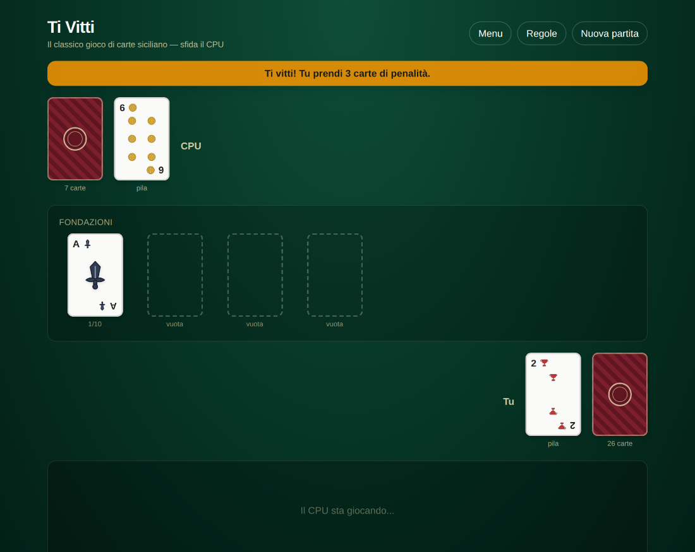

# Ti Vitti

Il tradizionale gioco di carte siciliano e calabrese, in versione digitale.
Si gioca **contro il CPU** oppure **online con un amico** tramite un
semplice link o codice — nessun account, nessuna registrazione.

**[🎮 Gioca subito → tivio-ten.vercel.app](https://tivio-ten.vercel.app)**



Fonte delle regole originali: [Ti vitti – Wikipedia](https://it.wikipedia.org/wiki/Ti_vitti).

---

## Come si gioca

Il mazzo da 40 carte (Denari, Coppe, Spade, Bastoni) viene diviso a metà, a
faccia in giù, tra te e l'avversario.

| Situazione | Cosa succede |
|---|---|
| Peschi un **Asso** | Apre una nuova fondazione al centro, e peschi di nuovo |
| La carta continua una fondazione dello stesso seme | Si gioca lì (es. un 5 di Denari su un 4 di Denari), e peschi di nuovo |
| La carta è adiacente (+1/−1) alla cima della pila dell'avversario | Si scarica lì, e peschi di nuovo |
| Nessuna di queste è possibile | La carta è "morta": va sulla tua pila, il turno passa |

La cima della tua pila di scarti **resta sempre viva**: in qualsiasi momento
del tuo turno (non solo appena dopo aver pescato) puoi provare a spostarla su
una fondazione o sulla pila dell'avversario, con le stesse regole della carta
appena girata. Una mossa buona è un bonus e il turno continua; una mossa
sbagliata è un errore come un altro.

Vince chi esaurisce per primo il proprio mazzo.

### Niente aiutini

Il cuore del gioco è accorgersi da soli di cosa si può fare, quindi
l'interfaccia non risponde mai al posto tuo:

- **I tre pulsanti di gioco sono sempre tutti presenti**, anche quando la
  mossa non è legale. Se piazzi la carta dove non ci sta, non ci arriva —
  finisce sui tuoi scarti — ed è un errore esattamente come scartare una
  carta ancora giocabile.
- **Nel log le due cose sono indistinguibili** da uno scarto normale: chi
  guarda deve valutare da sé se quella carta era ancora viva.
- **Il pulsante "Ti vitti!" è sempre disponibile**, anche quando non c'è
  nulla da cogliere — nessuno ti avvisa che l'avversario ha sbagliato. Ma
  gridare a vuoto costa: le 3 carte di penalità le prendi tu.

Contro il CPU la penalità è immediata (non si distrae mai quando tocca a
te); online scatta solo se l'avversario se ne accorge in tempo — vale
anche il contrario. Le regole complete sono consultabili anche dentro
l'app tramite il pulsante **Regole**.

## Modalità online

"Gioca online con un amico" collega due browser via **WebRTC**
([PeerJS](https://peerjs.com/), broker cloud gratuito usato solo per
l'aggancio iniziale — i dati della partita viaggiano poi direttamente tra
i due browser, senza passare da un backend). Chi crea la stanza ottiene un
codice a 5 caratteri e un link da condividere; l'altro apre il link o
inserisce il codice.

Essendo peer-to-peer diretto, funziona bene sulla maggior parte delle reti
domestiche/mobili ma può occasionalmente non riuscire a stabilirsi su reti
aziendali molto restrittive (senza un server TURN di fallback). Se la
stanza resta bloccata su "connessione in corso" a lungo, è probabile che
sia questo il caso.

## Stack tecnico

[Next.js](https://nextjs.org/) (App Router) · [TypeScript](https://www.typescriptlang.org/) · [Tailwind CSS](https://tailwindcss.com/) · [PeerJS](https://peerjs.com/) per il multiplayer P2P — nessun database, nessun backend.

## Sviluppo

```bash
npm install
npm run dev
```

Apri [http://localhost:3000](http://localhost:3000).

```bash
npm run lint    # ESLint
npm run build   # build di produzione
npm start       # avvia la build di produzione
```

## Deploy su Vercel

Il progetto è un'app Next.js standard, pronta per il deploy su
[Vercel](https://vercel.com/new): basta importare questo repository, Vercel
rileva automaticamente il framework e non servono variabili d'ambiente.
